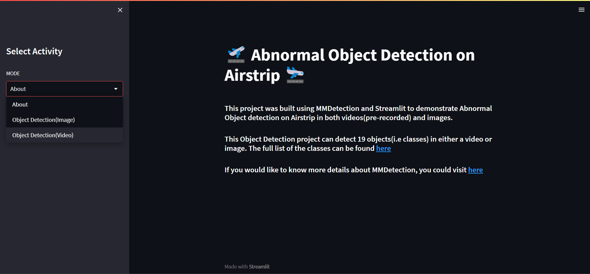

<a name="readme-top"></a>

# Airstrip Safer

<p align="left">
  
</p>


안전사고와 관련하여 `Object Detection`을 활용하는 방법을 고민 중에 활주로 내 비행기 이/착륙 시에 사고가 빈번히 일어난다는 [기사](https://www.joongang.co.kr/article/23463322#home)를 접했습니다.

만약, AI가 사고 원인이 되는 객체들을 실시간으로 탐지하여 육안으로 쉽게 인식할 수 있게 하고, 그에 따라 `사람이 탐지하는 것의 한계를 어느 정도 극복`하여 사고 예방에 기여하면 좋겠다는 생각이 들었습니다.

Project Airstrip_Safer는 활주로 내 비행기 사고에 위협이 되는 객체를 `이상 객체`로 규정하고, 이 객체들을 실시간으로 정확하게 탐지하는 AI CCTV를 만드는 것이 목표입니다.


<br>

<p align="right">(<a href="#readme-top">back to top</a>)</p>

## Project Architecture
```
<Proejct folder>
├── checkpoints
│   ├── Final model weight
│   ├── Initial model weight
│
├── configs
│   ├── FINAL.py
│   ├── original_config.py
│
├── env
│   ├── dataset.py
│   ├── setup.py
│   ├── streamlit_setup.py
│
├── tools
│   ├── train.py
│   ├── test.py
│   ├── inference.py
│
├── utils
│   ├── crawled_coco2middle.py
│   ├── crawler.py
│   ├── extract_split_move.py
│   ├── make_annotation.py
│   ├── make_mini-dataset.py
│   ├── streamlit.py
│
├── Run_Streamlit.ipynb
│
├── requirements.txt
```

<br>

<p align="right">(<a href="#readme-top">back to top</a>)</p>

## Model
Detection Model은 [MMDetection](https://github.com/open-mmlab/mmdetection)을 참고하여 [Deformable DETR](https://github.com/fundamentalvision/Deformable-DETR)을 사용했습니다. 

<br>

<p align="right">(<a href="#readme-top">back to top</a>)</p>

## Getting Started


### Prerequisites
1. mmdetection & mmcv 버젼 자동 호환 설치 (Streamlit 사용)
```
pip install openmim
mim install mmdet==2.25.1
```

2. [ngrok authentification token 발급](https://dashboard.ngrok.com/get-started/your-authtoken)

### Installation
1. Clone the repo
```
git clone https://github.com/Seongwoong-sk/Airstrip_Safer.git
```
2. Install packages & libraries
```
cd Airstrip_Safer

# local environment
pip install -r requirements.txt
```
or
```
cd Airstrip_Safer

# colab environment
python utils/setup.py
```

<br>

<p align="right">(<a href="#readme-top">back to top</a>)</p>

## How to Run

### Train & Validation
```
python tools/train.py \
--config configs/FINAL.py \                                 # If initial training, use original_config.py
--work_dir <path to save model weight files> \
--max_epochs <number> \                                     # 현재 epoch 기준으로 최대 epoch 설정
--checkpoint <checkpoint_path> \                            # Initial training / model weight path 지정
--resume_from <resume_checkpoint> \                         # Resume training / 저장돼있는 model weight path 지정
--seed <number> \
--validate <option> \                                       # If not, write False to option blank
--deterministic                                             # Set deterministic options for CUDNN backend 
```


### Test
```
python tools/test.py \
--config configs/FINAL.py \
--checkpoint <path to saved model weight file> \
--work_dir <path to save the file containing evaluation metrics> \
--out <output_filename.pkl> \                   
--eval mAP \
--show_dir <path to show painted images> \
--threshold 0.5
```

### Inference
```
python /content/drive/MyDrive/Air_PY/tools/inference.py \
--config configs/FINAL.py \
--checkpoint <path to saved model weight file> \
--img <path of img to inference> \                             # Img or Video at once 
--out_img <path to save the inferenced img > \                 # If img, set video & out_video as None
--video <path of video to inference> \                         # If video, set img & out_img as None
--out_video <path to save the inferenced video> \
--threshold 0.5 
```

<br>

<p align="right">(<a href="#readme-top">back to top</a>)</p>

## Deployment (Web App Application)
1. [Open Streamlit Colab Notebook](https://github.com/Seongwoong-sk/Airstrip_Safer/blob/main/Run_Streamlit.ipynb)

2. Click the ngrok secure tunnel to access to `Streamlit`
<p align="left">
  
</p>

3. Then, this homepage will be shown
<p align="left">
  
</p>


<br>

<p align="right">(<a href="#readme-top">back to top</a>)</p>


## Built With


<a href="https://www.python.org/"></a>&nbsp; 
<a href="https://pytorch.org/"></a>&nbsp; 
<a href="https://github.com/open-mmlab/mmdetection"></a>&nbsp; 
<a href="https://github.com/open-mmlab/mmcv"></a>&nbsp; 
<a href="https://opencv.org/)"></a>&nbsp; 
<a href="https://streamlit.io/"></a>&nbsp; 
<a href="https://ngrok.com/"></a>&nbsp; 
<a href="https://colab.research.google.com/?hl=ko"></a>&nbsp; 


<br>

<p align="right">(<a href="#readme-top">back to top</a>)</p>
